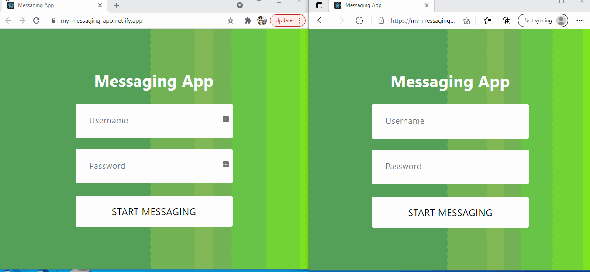

# Description:

This is a messaging application where users can send messages and images to each other. Utilizes local storage for username and password authentication. chatengine.io which serves as web socket for this application

## Website URL:

[Messaging App](https://killiman.xyz)

# Technologies Used:
* React
* Chatengine.io

# Installation
* To run this project first clone it then install modules using `npm install`.
* Create a new account with chatengine.io, create a new project, replace your projectID for projectID variable. Add users for your project through chatengine.io dashboard.
* To start this project type `npm start`.

# Demo

